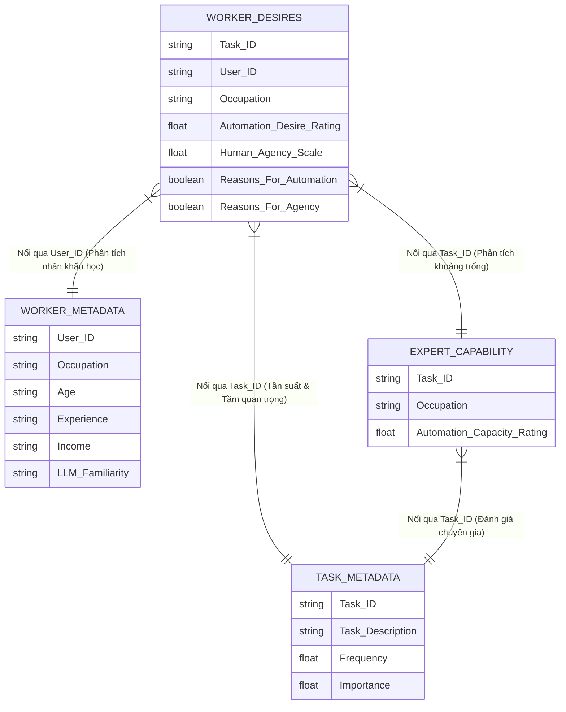
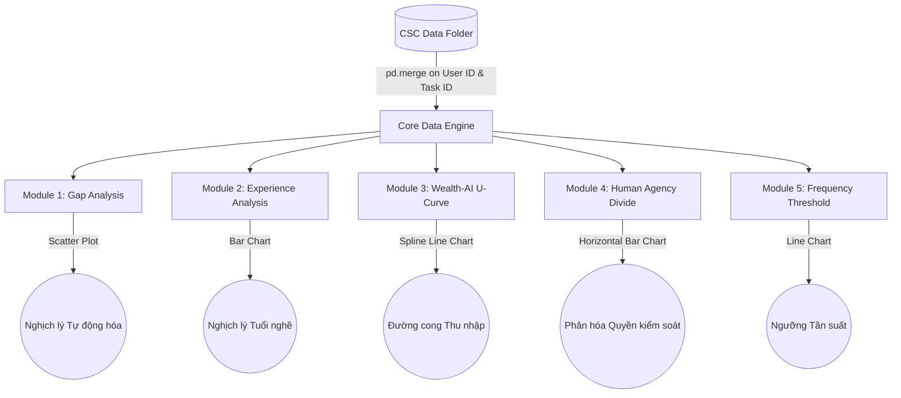

# Kiến trúc & Luồng Dữ liệu: AI Agent Research Project (CSC)

Tài liệu này mô tả chi tiết luồng dữ liệu (Dataflow) từ việc thu thập, làm sạch dữ liệu ban đầu cho đến khi tích hợp thành một hệ thống báo cáo (Markdown) và ứng dụng tương tác (Streamlit Dashboard) tập trung vào **Nhóm ngành Công nghệ Thông tin (Computer Science Cohort - CSC)**.

---

## 1. Kiến trúc Tổng thể (Overall Architecture)

```mermaid
graph LR
    subgraph "Raw Data"
        R1(Raw CSV Files)
    end

    subgraph "Data Preparation"
        F1[scripts/filter_it_data.py]
    end

    subgraph "CSC Data (Target)"
        D1[(CSC/domain_worker_desires)]
        D2[(CSC/expert_capability)]
        D3[(CSC/worker_metadata)]
        D4[(CSC/task_metadata)]
    end

    subgraph "Data Analysis & Presentation"
        A1[scripts/analyze_csc_data.py]
        A2[scripts/deep_dive.py]
        A3[app.py (Streamlit)]
    end

    subgraph "Outputs"
        O1(docs/csc_insights.md)
        O2((Interactive Web Dashboard))
    end

    R1 -->|Lọc 5 ngành IT| F1
    F1 -->|Ghi dữ liệu| D1
    F1 -->|Ghi dữ liệu| D2
    F1 -->|Ghi dữ liệu| D3
    F1 -->|Ghi dữ liệu| D4

    D1 & D2 & D3 & D4 -->|Trích xuất Insights| A1
    A1 -->|Báo cáo tĩnh| O1

    D1 & D2 & D3 & D4 -->|EDA Nâng cao| A2

    D1 & D2 & D3 & D4 -->|Render Biểu đồ| A3
    A3 -->|Deploy| O2
```

---

## 2. Sơ đồ Thực thể - Quan hệ (Entity-Relationship) trong tập dữ liệu CSC
Dữ liệu của dự án được lưu thành 4 bảng chính. Các bảng này liên kết với nhau thông qua `User ID` (Định danh người tham gia khảo sát) và `Task ID` (Định danh công việc cụ thể).



---

## 3. Luồng Xử lý Phân tích và Dashboard (Processing Pipeline)
Khi chạy ứng dụng Streamlit (`app.py`), dữ liệu sẽ được gộp (merge) và biến đổi để tạo ra 5 luồng biểu đồ độc lập tương ứng với 5 Deep Insights.



## 4. Tóm tắt vai trò các file
- `filter_it_data.py`: Dùng một lần để làm sạch dữ liệu và trích xuất nhóm ngành đích (CSC).
- `analyze_csc_data.py`: Sinh ra báo cáo Markdown tĩnh (csc_insights.md).
- `deep_dive.py`: Script dùng để nghiên cứu sâu (thử nghiệm correlation, pandas group-by) trên terminal.
- `app.py`: File ứng dụng web trực quan hóa toàn bộ dự án, có thể dùng để đi báo cáo/demo.
